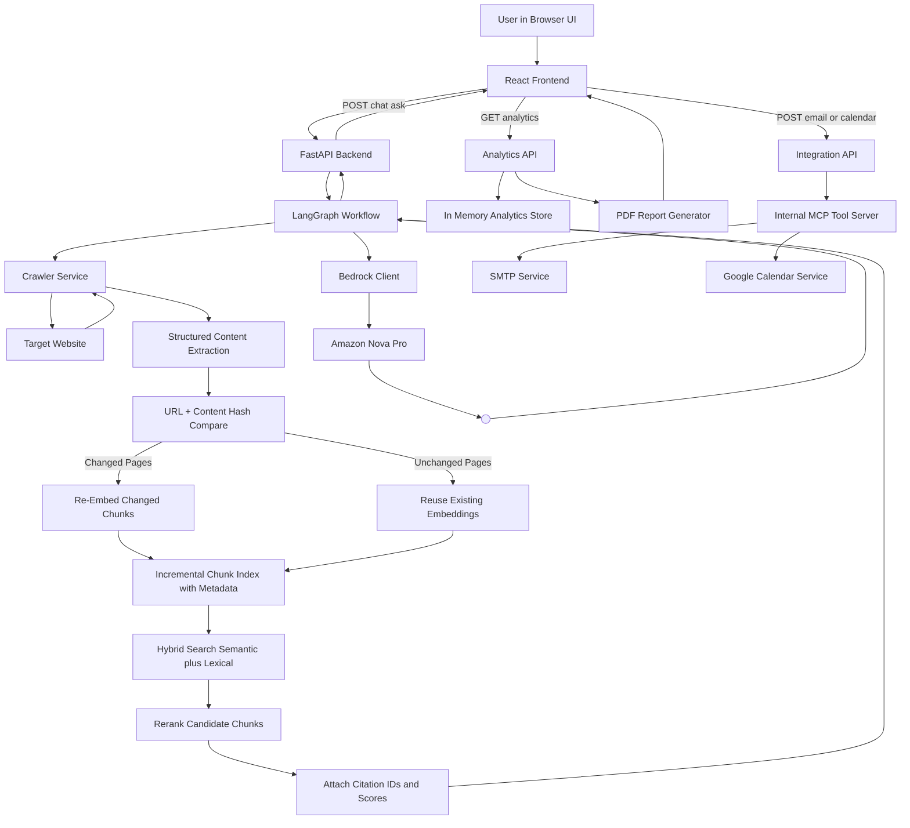

# Ness GPT

Ness GPT is a website-grounded chatbot prototype where users provide a target website URL, content is crawled and incrementally indexed in real time, and answers are generated with LangGraph orchestration and Amazon Nova Pro through AWS Bedrock.

The system also includes:
- SMTP email integration
- Google Calendar integration
- Chat analytics summary
- PDF report export per session

## Goals

1. Accept a target website URL and user question.
2. Crawl fresh content for each question.
3. Use orchestrated LLM reasoning over crawled context.
4. Allow operational actions through tool integrations (email and calendar).
5. Provide measurable analytics and downloadable reports.

## High-Level Architecture



   ## LangGraph Workflow Diagram

   ```mermaid
   flowchart LR
      A[Chat API receives request] --> B[Initialize ChatGraphState]
      B --> C[Node: crawl_website]
      C --> D[WebsiteCrawler fetches pages]
      D --> E[Extract structured segments and metadata]
      E --> F[Compute URL content hashes]
      F --> G{Hash changed?}
      G -->|Yes| H[Re-chunk and re-embed changed pages]
      G -->|No| I[Skip re-embed for unchanged pages]
      H --> J[Update incremental index]
      I --> J
      J --> K[Hybrid retrieval semantic plus lexical]
      K --> L[Rerank candidate chunks]
      L --> M[Attach citation_id score metadata]
      M --> N[Update state with chunks sources and crawl stats]
      N --> O[Node: generate_answer]
      O --> P[BedrockChatClient grounded prompt]
      P --> Q[Amazon Nova Pro via Bedrock]
      Q --> R[Update state: answer]
      R --> S[Graph END]
      S --> T[Chat API returns answer plus sources and events]
   ```

## Repository Structure

- frontend
   - React + Vite client
   - Chat UI, analytics UI, API client code
- backend
   - FastAPI API server
   - LangGraph workflow
   - Crawler, Bedrock, integrations, analytics services
- docs
   - Architecture, API spec, Figma mapping notes
- .env.example
   - Required environment variable template

## Component Contribution Map

### Frontend Components

1. frontend/src/App.tsx
- Creates the core two-pane layout.
- Initializes a session id used across chat and analytics calls.
- Composes chat and analytics feature panels.

2. frontend/src/features/chat/ChatPanel.tsx
- Captures target URL and question input.
- Sends chat requests to backend.
- Renders user and assistant messages.
- Displays grounding citations with citation ID and score.
- Handles loading and error states.

3. frontend/src/features/analytics/AnalyticsPanel.tsx
- Pulls session analytics metrics.
- Shows key counters in dashboard cards.
- Exposes link to downloadable PDF report.

4. frontend/src/services/api.ts
- Central API client wrapper.
- Defines shared response types used by UI.
- Keeps frontend endpoint calls consistent and maintainable.

5. frontend/src/styles/global.css
- Defines visual identity (typography, colors, spacing).
- Implements responsive behavior and animation primitives.
- Styles chat bubbles, source list, forms, and analytics cards.

### Backend Components

1. backend/app/main.py
- FastAPI app bootstrap.
- CORS middleware setup for frontend origin.
- Health route and API router registration.

2. backend/app/api/router.py
- Aggregates and mounts all v1 route groups.
- Keeps API versioning clear and modular.

3. backend/app/api/v1/chat.py
- Main chat endpoint.
- Builds initial LangGraph state from user input.
- Executes workflow and returns answer plus sources.
- Emits analytics tracking for user and assistant turns.

4. backend/app/api/v1/integrations.py
- Lists available internal tools.
- Exposes email send endpoint.
- Exposes calendar event creation endpoint.
- Tracks integration usage for analytics.

5. backend/app/api/v1/analytics.py
- Returns session-level metrics summary.
- Produces PDF report files for a session.

6. backend/app/core/settings.py
- Typed environment configuration using pydantic settings.
- Single source of truth for AWS, SMTP, calendar, crawler, and app settings.

### LangGraph Workflow Components

1. backend/app/graph/state.py
- Defines graph state contract across nodes.
- Carries session id, URL, question, chunks, sources, answer, tool events.

2. backend/app/graph/nodes/crawl_node.py
- Triggers crawl service.
- Syncs incremental index with hash change detection.
- Runs hybrid retrieval plus reranking.
- Emits metadata-rich citations into graph state.

3. backend/app/graph/nodes/generate_node.py
- Invokes Bedrock client with question plus crawled chunks.
- Stores generated answer in graph state.

4. backend/app/graph/workflow.py
- Connects nodes in execution order.
- Compiles runnable async graph.

5. backend/app/services/retrieval/incremental_index.py
- Preserves chunk metadata in persistent index.
- Performs hybrid retrieval and reranking.
- Returns citation-aware chunk results.

### Service Layer Components

1. backend/app/services/crawler/service.py
- Fetches website HTML with timeout and user-agent controls.
- Extracts title and plain text for grounding context.
- Returns normalized crawled page objects.

2. backend/app/services/bedrock/client.py
- Builds Bedrock chat model adapter.
- Creates grounding prompt and asynchronously queries Nova Pro.

3. backend/app/services/mcp/server.py
- Internal tool registry and dispatcher abstraction.
- Provides a stable interface to invoke integration tools.
- Current tools: send_email, create_calendar_event.

4. backend/app/services/integrations/email_smtp.py
- Sends email through SMTP host with optional TLS/auth.
- Validates that essential SMTP settings are configured.

5. backend/app/services/integrations/calendar_google.py
- Builds Google Calendar API client from credentials.
- Creates events in primary calendar.

6. backend/app/services/analytics/service.py
- In-memory event store for session metrics.
- Computes summary counters and averages.

7. backend/app/services/analytics/report_pdf.py
- Generates PDF report from analytics summary.
- Persists report under reports directory and returns file path.

8. backend/app/services/retrieval/incremental_index.py
- Persists chunk text, embeddings, and metadata.
- Uses URL plus content hash to skip unchanged pages.
- Applies hybrid search and reranking before returning citations.

### Schema Components

1. backend/app/schemas/chat.py
- Strong request and response contracts for chat API.
- Includes citation metadata and ranking score in sources.

2. backend/app/schemas/integrations.py
- Validation contracts for email and calendar payloads.

3. backend/app/schemas/analytics.py
- Typed analytics summary output contract.

## End-to-End Runtime Flow

1. User provides target website URL and question in frontend.
2. Frontend posts chat request.
3. Chat endpoint starts LangGraph workflow.
4. Crawl node fetches site pages and extracts structured segments.
5. Incremental index compares hashes and re-embeds only changed pages.
6. Hybrid retrieval and reranking select best chunks.
7. Generate node calls Bedrock Nova Pro with grounded chunks.
8. Backend returns answer with citation IDs, scores, and metadata.
9. Analytics events are tracked and can be queried.
10. User can download a PDF session analysis report.
11. User can trigger integration actions via email/calendar endpoints.

## API Surface

Base URL: http://localhost:8000/api/v1

1. POST /chat/ask
- Input: session_id, website_url, question
- Output: answer, sources, tool_events

2. GET /integrations/tools
- Output: available internal MCP tools

3. POST /integrations/email
- Input: to, subject, body
- Output: SMTP send result

4. POST /integrations/calendar
- Input: summary, description, start_iso, end_iso, attendee_emails
- Output: calendar event metadata

5. GET /analytics/{session_id}
- Output: session analytics summary

6. GET /analytics/{session_id}/report
- Output: PDF report file

## Local Setup

1. Copy .env.example to .env and fill values.
2. Start backend:
    - cd backend
    - pip install -r requirements.txt
    - uvicorn app.main:app --reload --port 8000
3. Start frontend:
    - cd frontend
    - npm install
    - npm run dev
4. Open http://localhost:5173

## Environment Variables

Defined in .env.example:
- AWS Bedrock: region, credentials, model id
- App: environment, ports, frontend origin
- SMTP: host, port, user, password, sender, TLS toggle
- Google Calendar: client id, client secret, redirect URI, refresh token
- Crawler: page budget, timeout, user agent
- Storage: database URL placeholder

## Current Limitations

1. Analytics storage is in-memory and resets on restart.
2. Some JS-heavy and anti-bot sites may return limited crawl content without a browser-render fallback.
3. LangGraph flow is linear today; tool-intent routing is a next step.
4. UI is a strong baseline but not yet full pixel-level parity to design.

## Suggested Next Iteration

1. Add persistent database models for sessions, messages, and analytics.
2. Add deeper crawling with controlled link traversal.
3. Add automatic tool invocation decisions inside graph based on intent.
4. Add authentication and per-user session ownership.
5. Complete final Figma parity pass for all interaction states.
